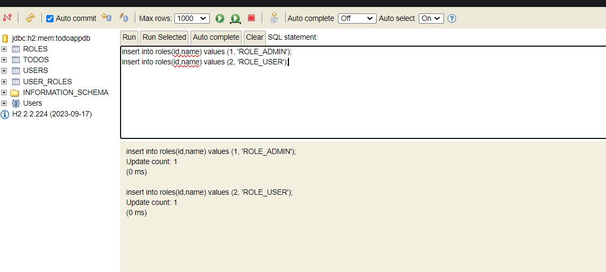

# Swagger


## For opening h2-database
- Go to http://localhost:8081/h2-console

- Use the following settings:
  - **JDBC URL**: `jdbc:h2:mem:todoappdb`
  - **User Name**: `sa`
  - **Password**: `password`
- Then Insert Data into roles table
```
  insert into roles(id,name) values (1, 'ROLE_ADMIN');
  insert into roles(id,name) values (2, 'ROLE_USER');
  ```

-  After that you are ready to go.


